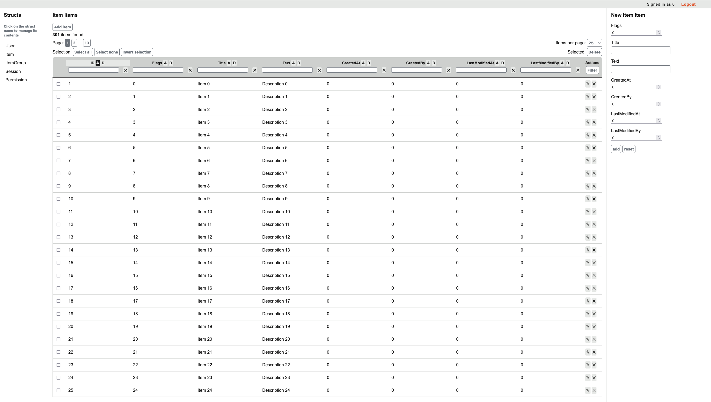

# crud-ui

 

Package CRUD UI allows you to run a simple administration panel for struct instances stored in the database. The idea is that you define structs, attach ORM and run a simple function.

## Example usage

Please check a sample application in the `cmd` directory or type in `make run-sample-app1` to start it, and navigate to `http://localhost:9001/ui/`.

